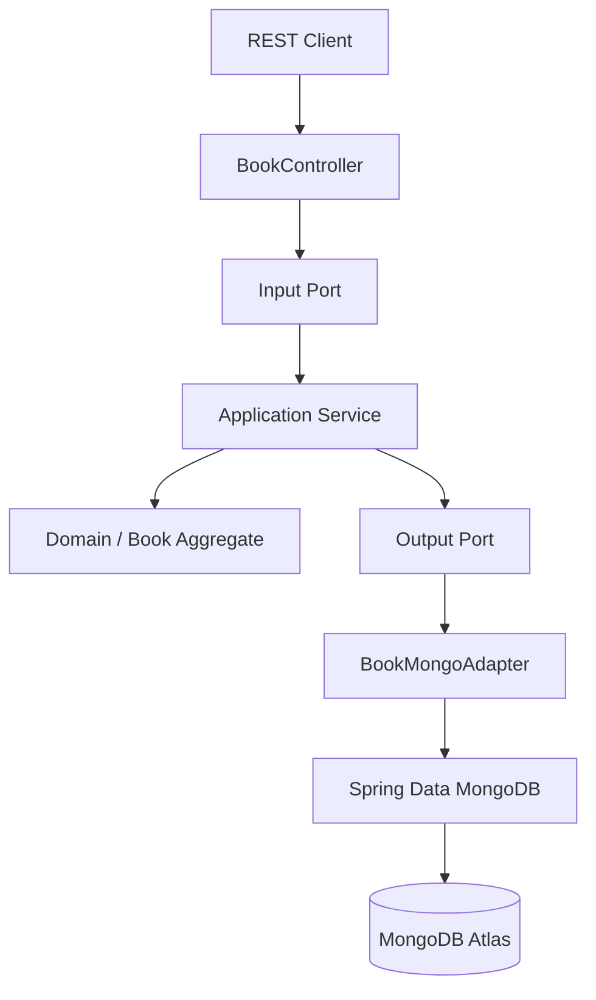
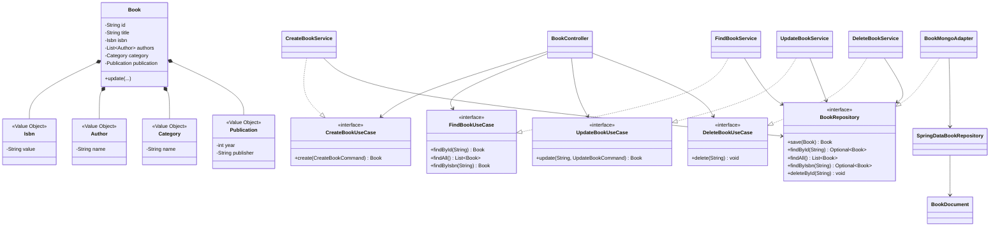
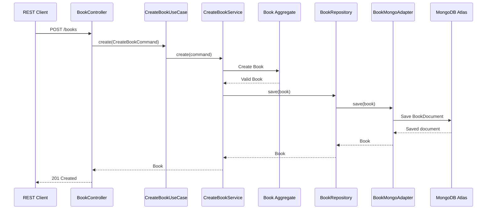

# Library Application

## Overview

Library Application is a backend application developed as a Proof of Concept (POC) to demonstrate the implementation of a library management system using **Java, Spring Boot, MongoDB and Hexagonal Architecture**.

The application allows users to create, search, update and delete books.

The project also demonstrates concepts from **Domain-Driven Design (DDD)**, including Aggregate, Aggregate Root and Value Objects.

The persistence layer uses **MongoDB Atlas**, accessed through Spring Data MongoDB.

---

## Objectives

The main objectives of this project are:

* Practice Java and Spring Boot development.
* Use MongoDB as a NoSQL document database.
* Understand Documents, Collections and Embedded Documents.
* Use Spring Data MongoDB.
* Understand and apply Hexagonal Architecture.
* Apply basic DDD concepts.
* Understand the concept of Aggregate and Aggregate Root.
* Use Value Objects in the domain.
* Separate Domain, Application and Infrastructure concerns.
* Implement a REST API with CRUD operations.
* Apply DTOs and Mappers.
* Implement global exception handling.

---

## Technologies

* Java 25
* Spring Boot 4.1.1
* Spring Web MVC
* Spring Data MongoDB
* MongoDB Atlas
* Bean Validation
* Maven
* Springdoc OpenAPI / Swagger UI
* Mermaid

---

## Architecture

The project follows **Hexagonal Architecture**, also known as Ports and Adapters.

The main idea is to keep the Domain independent from external technologies such as MongoDB, HTTP and Spring Data.



The main architectural principle is:

> The Domain does not know that MongoDB exists.

---

## Domain

The Domain contains the business model and business rules of the application.

The main Aggregate is:

```text
Book
 ├── Isbn
 ├── Author
 ├── Category
 └── Publication
```

### Aggregate Root

`Book` is the **Aggregate Root**.

It controls the consistency of the book and its internal objects.

The domain validates rules such as:

* Book title cannot be empty.
* ISBN cannot be empty.
* ISBN must contain 13 digits.
* A book must have at least one author.
* Category cannot be empty.
* Publication year must be valid.
* Publisher cannot be empty.

### Value Objects

The project uses Java Records as Value Objects:

* `Isbn`
* `Author`
* `Category`
* `Publication`

For example, instead of representing an ISBN only as a `String`, the Domain uses:

```java
Isbn isbn
```

This allows the object itself to protect its validity.

---

## Application

The Application layer contains the use cases and coordinates the execution of business operations.

### Input Ports

The application exposes the following use cases:

* `CreateBookUseCase`
* `FindBookUseCase`
* `UpdateBookUseCase`
* `DeleteBookUseCase`

### Application Services

Each use case has an application service:

* `CreateBookService`
* `FindBookService`
* `UpdateBookService`
* `DeleteBookService`

The services depend on the `BookRepository` output port instead of depending directly on MongoDB.

---

## Interface Adapters

The Interface Adapters translate information between the external world and the application/domain.

### Input Adapter

The REST controller is the input adapter:

```text
BookController
```

It receives HTTP requests and converts them into application commands.

### Output Adapter

The MongoDB adapter is responsible for communicating with the database:

```text
BookMongoAdapter
```

It implements the application output port:

```text
BookRepository
```

This means the Application layer does not depend directly on MongoDB.

### DTOs

The REST API uses DTOs to separate the HTTP representation from the Domain model:

* `CreateBookRequest`
* `UpdateBookRequest`
* `BookResponse`

### Mappers

The project uses two types of mappers:

```text
BookWebMapper
BookMongoMapper
```

`BookWebMapper` converts between Domain objects and API responses.

`BookMongoMapper` converts between Domain objects and MongoDB Documents.

---

## Frameworks & Drivers

The external technologies are located at the outer layers of the architecture.

The main frameworks and drivers are:

* Spring Boot
* Spring Web MVC
* Spring Data MongoDB
* MongoDB Atlas
* Bean Validation
* Springdoc OpenAPI

The MongoDB persistence model is represented by:

* `BookDocument`
* `IsbnDocument`
* `AuthorDocument`
* `CategoryDocument`
* `PublicationDocument`

---

## Dependency Rule

Dependencies should point toward the application and domain concepts.

```text
External World
      ↓
Adapters
      ↓
Application
      ↓
Domain
```

The Domain must not depend on:

* MongoDB
* Spring Data MongoDB
* HTTP
* Controllers
* DTOs

For example:

```text
Book
```

does not know anything about:

```text
BookDocument
MongoRepository
MongoDB Atlas
BookController
```

The conversion between these representations is handled by the adapters and mappers.

---

## Package Structure

```text
src/main/java/com/ricardo/library
│
├── LibraryApplication.java
│
├── domain
│   ├── model
│   │   ├── Book.java
│   │   ├── Isbn.java
│   │   ├── Author.java
│   │   ├── Category.java
│   │   └── Publication.java
│   │
│   └── exception
│       ├── DomainException.java
│       └── ResourceNotFoundException.java
│
├── application
│   ├── port
│   │   ├── in
│   │   │   ├── CreateBookUseCase.java
│   │   │   ├── FindBookUseCase.java
│   │   │   ├── UpdateBookUseCase.java
│   │   │   └── DeleteBookUseCase.java
│   │   │
│   │   └── out
│   │       └── BookRepository.java
│   │
│   └── service
│       ├── CreateBookService.java
│       ├── FindBookService.java
│       ├── UpdateBookService.java
│       └── DeleteBookService.java
│
└── adapter
    ├── in
    │   └── web
    │       ├── BookController.java
    │       ├── GlobalExceptionHandler.java
    │       ├── dto
    │       │   ├── CreateBookRequest.java
    │       │   ├── UpdateBookRequest.java
    │       │   └── BookResponse.java
    │       │
    │       └── mapper
    │           └── BookWebMapper.java
    │
    └── out
        └── mongodb
            ├── document
            │   ├── BookDocument.java
            │   ├── IsbnDocument.java
            │   ├── AuthorDocument.java
            │   ├── CategoryDocument.java
            │   └── PublicationDocument.java
            │
            ├── repository
            │   └── SpringDataBookRepository.java
            │
            ├── BookMongoAdapter.java
            └── BookMongoMapper.java
```

The project does not require a `BeanConfiguration` class because Spring automatically discovers the services and adapters registered with annotations such as `@Service` and `@Component`.

---

## Class Diagram



### Diagram Notes

`Book` is the Aggregate Root.

`Isbn`, `Author`, `Category` and `Publication` are Value Objects contained inside the Book Aggregate.

The Application Services depend on the `BookRepository` output port.

`BookMongoAdapter` implements this port and communicates with Spring Data MongoDB.

This keeps MongoDB-specific details outside the Domain and Application layers.

---

## Sequence Diagram — Create Book

The following sequence represents the creation of a book.



---

## API Endpoints

| Method | Endpoint             | Description         |
| ------ | -------------------- | ------------------- |
| POST   | `/books`             | Create a book       |
| GET    | `/books`             | List all books      |
| GET    | `/books/{id}`        | Find a book by ID   |
| GET    | `/books/isbn/{isbn}` | Find a book by ISBN |
| PUT    | `/books/{id}`        | Update a book       |
| DELETE | `/books/{id}`        | Delete a book       |

---

## API Usage Examples

### Create Book

**POST**

```text
http://localhost:8080/books
```

Request:

```json
{
  "title": "Domain-Driven Design",
  "isbn": "9780321125217",
  "authors": [
    "Eric Evans"
  ],
  "category": "Software Engineering",
  "publicationYear": 2003,
  "publisher": "Addison-Wesley"
}
```

Response:

```json
{
  "id": "generated-uuid",
  "title": "Domain-Driven Design",
  "isbn": "9780321125217",
  "authors": [
    "Eric Evans"
  ],
  "category": "Software Engineering",
  "publicationYear": 2003,
  "publisher": "Addison-Wesley"
}
```

### List Books

**GET**

```text
http://localhost:8080/books
```

### Find Book by ID

**GET**

```text
http://localhost:8080/books/{id}
```

### Find Book by ISBN

**GET**

```text
http://localhost:8080/books/isbn/9780321125217
```

### Update Book

**PUT**

```text
http://localhost:8080/books/{id}
```

Request:

```json
{
  "title": "Domain-Driven Design Updated",
  "isbn": "9780321125217",
  "authors": [
    "Eric Evans"
  ],
  "category": "Software Engineering",
  "publicationYear": 2003,
  "publisher": "Addison-Wesley"
}
```

### Delete Book

**DELETE**

```text
http://localhost:8080/books/{id}
```

---

## Error Handling

The application uses a global exception handler through `@RestControllerAdvice`.

The main handled errors are:

### Resource Not Found

When a book does not exist:

```text
HTTP 404 Not Found
```

Example:

```json
{
  "status": 404,
  "message": "Book not found: <id>",
  "timestamp": "2026-10-08T16:00:00"
}
```

### Domain Error

When a business rule is violated:

```text
HTTP 400 Bad Request
```

For example:

* Empty title
* Invalid ISBN
* Empty author list
* Invalid publication year

### Validation Error

Invalid request data also returns:

```text
HTTP 400 Bad Request
```

The API uses Bean Validation annotations such as:

```java
@NotBlank
@NotEmpty
@NotNull
```

---

## Running the Application

### Prerequisites

Before running the application, make sure you have:

* Java 25
* Maven
* STS or another Java IDE
* Internet access
* A configured MongoDB Atlas cluster
* A MongoDB Atlas database user
* Your current IP authorized in MongoDB Atlas

No local MongoDB installation or Docker container is required.

---

### Clone the Repository

Clone the project repository:

```bash
git clone https://github.com/ricardobfernandes/POC-noSQL.git
```

---

### Navigate to the Project Folder

```bash
cd POC-noSQL
```

---

### Configure MongoDB Atlas

The application uses the MongoDB Atlas connection URI through the `MONGODB_URI` environment variable.

The `application.properties` file should contain:

```properties
spring.application.name=library
spring.mongodb.uri=${MONGODB_URI}
```

Do not commit the MongoDB username or password to GitHub.

Configure the `MONGODB_URI` environment variable in the IDE or operating system.

Example format:

```text
mongodb+srv://<username>:<password>@<cluster>/<database>
```

The actual connection string must be obtained from your MongoDB Atlas cluster.

---

### Run the Application

Using Maven:

```bash
mvn spring-boot:run
```

Or run the main class:

```text
LibraryApplication
```

The application will start on:

```text
http://localhost:8080
```

---

## Mongo Database

The application uses **MongoDB Atlas** as its persistence layer.

The main database is:

```text
library
```

The main collection is:

```text
books
```

A stored document has approximately the following structure:

```json
{
  "_id": "generated-uuid",
  "title": "Domain-Driven Design",
  "isbn": {
    "value": "9780321125217"
  },
  "authors": [
    {
      "name": "Eric Evans"
    }
  ],
  "category": {
    "name": "Software Engineering"
  },
  "publication": {
    "year": 2003,
    "publisher": "Addison-Wesley"
  }
}
```

The nested objects demonstrate the use of **Embedded Documents** in MongoDB.

The relationship can be represented as:

```text
MongoDB Atlas
    │
    └── library
          │
          └── books
                │
                ├── Book document
                │     ├── isbn
                │     ├── authors
                │     ├── category
                │     └── publication
                │
                └── Book document
```

---

## Swagger / OpenAPI

The project also includes Springdoc OpenAPI.

After starting the application, the Swagger UI can be accessed at:

```text
http://localhost:8080/swagger-ui/index.html
```

It can be used to inspect and execute the available API operations.

---

## Author

Ricardo Fernandes

Product Engineering Analyst

GitHub: https://github.com/ricardobfernandes